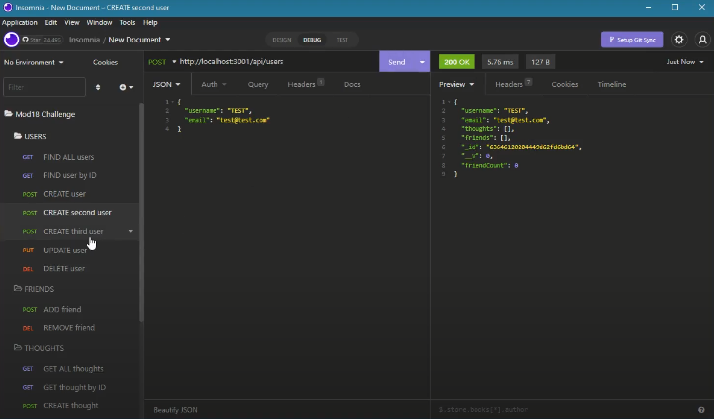
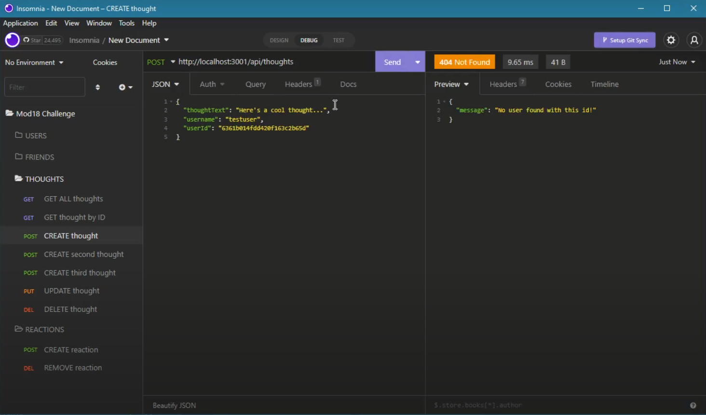

# Module #18 Challenge: Social Network API

## Description

This project is an **API for a social network web application** where users can share their thoughts, react to friends’ thoughts, and create a friend list. This project uses:

* **Express.js** for routing
* **MongoDB** database
* **Mongoose** ODM

[Click HERE to view the project demonstration video!](https://drive.google.com/file/d/19eTb1_nCPxGqTYqVPLPq9cAlQUOz5mjq/view)


## Table of Contents

* [Installation](#installation)
* [Usage](#usage)
* [Screenshots](#screenshots)
* [Questions](#questions)


## Installation

To install necessary dependencies, run the following command:
```
npm i
```


## Usage

In the root directory of the project, run the following command to start a series of prompts:
```
npm start
```

### User Endpoints

FIND all users
```
GET: http://localhost:3001/api/users
```

FIND user by ID
```
GET: http://localhost:3001/api/users/<userID>
```

CREATE user
```
POST: http://localhost:3001/api/users
```

UPDATE user
```
PUT: http://localhost:3001/api/users/<userID>
```

DELETE user
```
DELETE: http://localhost:3001/api/users/<userID>
```

### Friend Endpoints

ADD friend
```
POST: http://localhost:3001/api/users/<userID>/friends/<friendID>
```

DELETE friend
```
DELETE: http://localhost:3001/api/users/<userID>/friends/<friendID>
```

### Thought Endpoints

FIND all thoughts
```
GET: http://localhost:3001/api/thoughts
```

FIND thought by ID
```
GET: http://localhost:3001/api/thoughts/thoughtID>
```

CREATE thought
```
POST: http://localhost:3001/api/thoughts
```

UPDATE thought
```
PUT: http://localhost:3001/api/thoughts/<thoughtID>
```

DELETE thought
```
DELETE: http://localhost:3001/api/thoughts/<thoughtID>
```

### Reaction Endpoints

ADD reaction
```
POST: http://localhost:3001/api/thoughts/<thoughtID>/reactions/<reactionID>
```

DELETE reaction
```
DELETE: http://localhost:3001/api/thoughts/<thoughtID>/reactions/<reactionID>
```


## Screenshots





## Questions

If you have any questions about this repository, please open an issue. You can also find more of my work at [desguerra](https://github.com/desguerra) on GitHub.